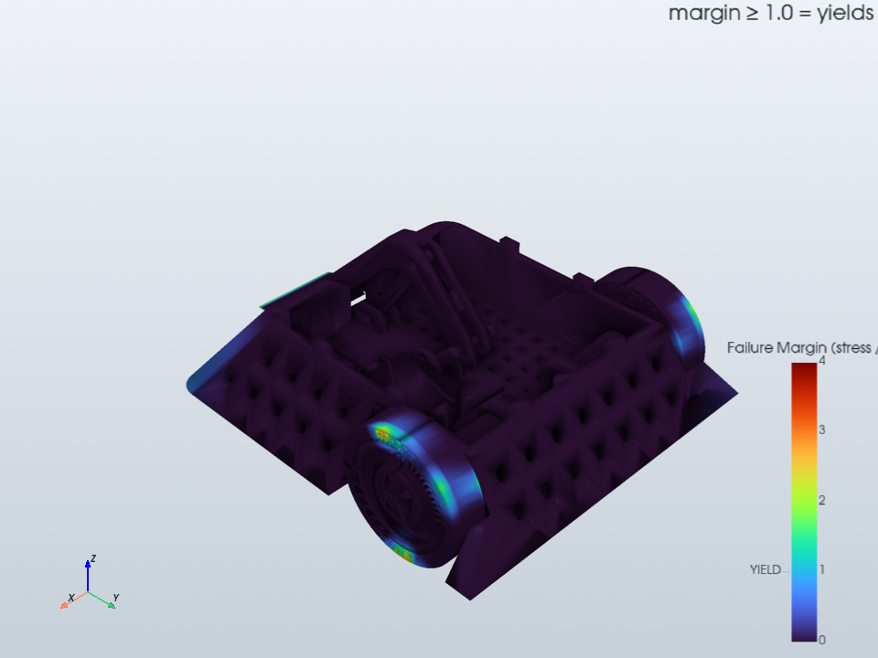
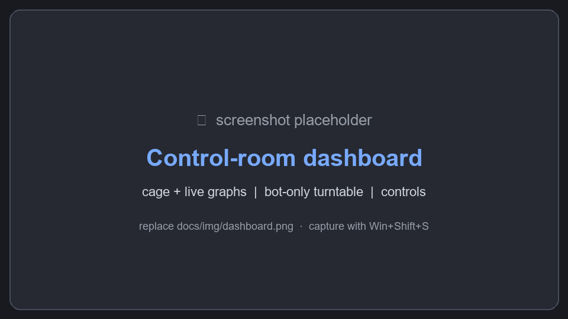
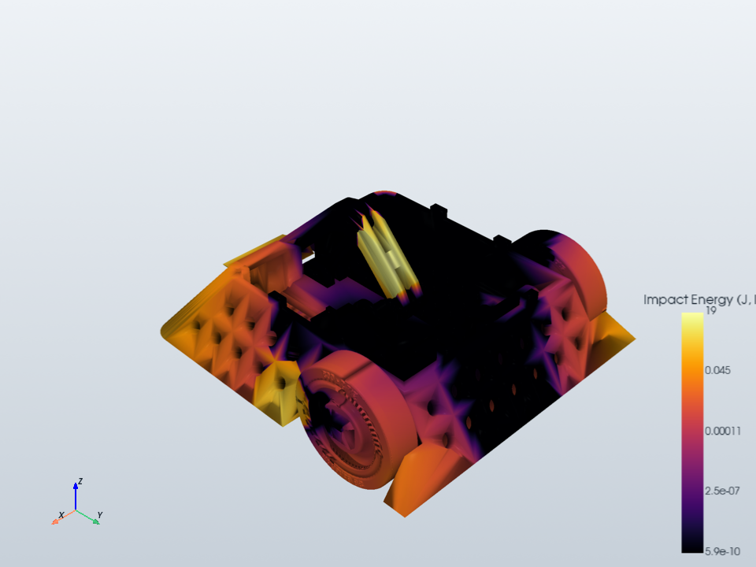
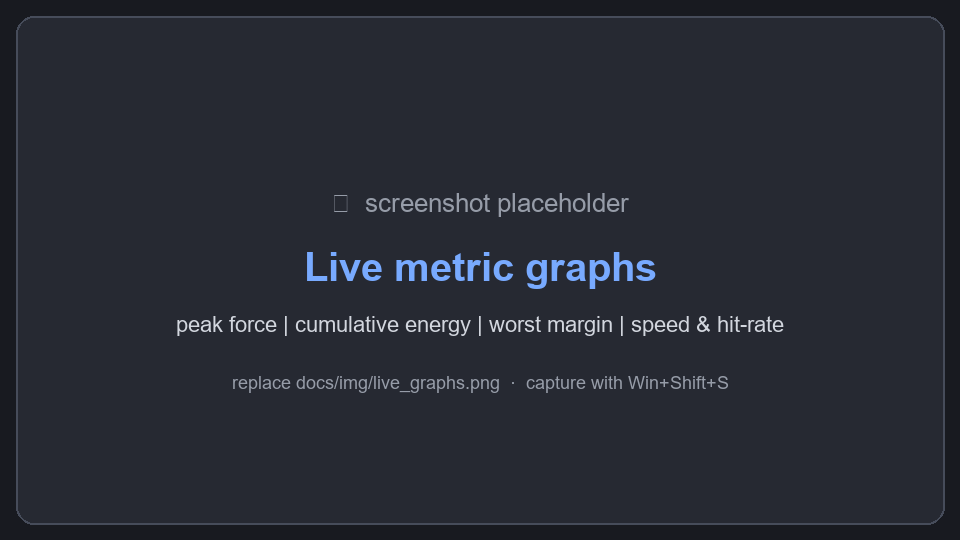
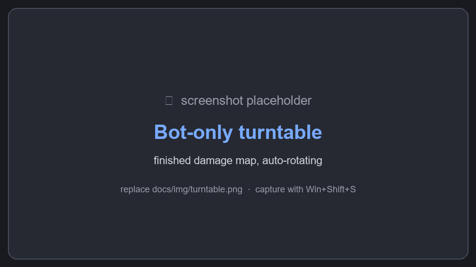

# Combat Robot Stress-Test Gauntlet

_Made by Neel Bansal._

A Windows desktop app that predicts **where a combat robot will take damage** before
you cut any metal. Load your bot's model (STL, 3MF, or glTF), assign real materials to
its parts, pick an NHRL weight class, and the app runs your bot through an automated
"flinging" stress battery inside a physics-simulated test cage — then shows you a live
fly-around, four metric-vs-time graphs, and two damage heatmaps.



> **Engineering-grade analytic model.** A real rigid-body physics engine (MuJoCo)
> handles the flinging and collisions; an analytic mechanics-of-materials model gives an
> *absolute* per-part failure verdict — subsurface von-Mises contact yield (first yield
> at p0 ≈ 1.6·yield), a combined-curvature contact that models the opponent weapon as a
> sharp striker, and per-part beam/plate bending & membrane stress with brace
> load-sharing. Hand-calc grade, **not** FEA — read
> [docs/model_assumptions.md](docs/model_assumptions.md) before trusting a number.

## What it does

1. **Load a model** → a named multi-body file (3MF / glTF) keeps each body as its own
   part with its CAD name; an STL is auto-segmented into connected solid parts named
   `part_0`, `part_1`… (chassis, armor, wedge, brace…). Or hit **Load sample bot** to try
   the whole pipeline instantly.
2. **Assign materials** per part from a library (aluminums, steels, titanium, polycarbonate,
   UHMW, HDPE, TPU, carbon fiber — all editable). **Click parts in the 3D view to select
   them** (Ctrl/Shift to multi-select), then assign a material to the whole selection at
   once; each part is tinted by its material so the table doubles as a legend. Mass, centre
   of mass, and inertia are computed and **validated against the NHRL weight class**
   (3 / 12 / 30 lb).
3. **Tag braces** so the model accounts for structural load-sharing.
4. **Run the stress battery** — drops, wall slams at several speeds/angles, a tumble, and
   opponent-weapon strikes, all scaled to the weight class, simulated in MuJoCo inside the
   class-sized cage. It runs **live**: watch the bot fly around the cage in real time (with a
   playback-speed control and a Stop button) while four metric-vs-time graphs — peak contact
   force, cumulative impact energy, worst failure margin, and bot speed/hit-rate — fill in as
   the impacts happen.

   
   <!-- ↑ live-UI shot — capture the running app (Win+Shift+S) and overwrite docs/img/dashboard.png -->

5. **See the results**:
   - the **live fly-around** in the cage (and a slider to re-scrub it afterwards),
   - a **separate bot-only view** that auto-rotates the finished bot on a turntable,
   - an **Impact-Energy** heatmap and a **Failure-Margin** heatmap (peak stress ÷ yield;
     ≥ 1 means it would yield), rendered as a smooth exponential gradient of hotspots with a
     labelled key — damage is spread from the real physics-engine contacts, not painted on
     single triangles,
   - an exportable **report** (two PNG heatmaps + a markdown summary with a per-part table
     and worst impacts).

| Impact energy (log scale) | Failure margin (stress ÷ yield) |
|---|---|
|  |  |

<!-- live-UI shots to capture and drop in: -->
<!--  -->
<!--  -->

## Under the hood (and why you can trust the numbers)

Most of the real work is invisible while you click — here's what's actually happening, and
how it's been checked. None of this is hand-waving: each piece is independently tested.

**The failure verdict is absolute mechanics-of-materials, not a relative score.** For every
part, at the *true* contact point, the model computes:
- **Subsurface von-Mises contact yield** — Hertzian contact puts peak shear *below* the
  surface, so first yield is at `σ_vm,max = 0.62·p0`, i.e. `p0 ≈ 1.6·σ_yield`, not at the
  surface pressure.
- **Combined-curvature contact radius** — the opponent weapon is modelled as a sharp
  striker, so a thin spinner tooth concentrates load far more than a flat slam.
- **PCA-oriented beam/plate section** with **bending** (`σ = 6·b·F·L / w·t²`) and
  **membrane** (`F/A`) stress; the model takes the **governing** stress and flags a
  **fracture** when it reaches ultimate. Bending is only applied to genuinely slender
  members, so a stubby block can't report impossible beam stress.

This margin is **decoupled** from the heatmap-spread constants — change the cosmetic
smoothing and the verdict doesn't move (see [docs/sensitivity.md](docs/sensitivity.md)).

**Braces share load the right way.** A part flagged as a brace (auto-detected on import for
elongated, stiff, load-bridging members; user-overridable) *relieves* the bending and
membrane stress of the parts it bridges and the governing margin is recomputed — rather
than dumping a synthetic extra load onto the verdict.

**The heatmaps are physics-grounded.** Each MuJoCo contact is spread as a Gaussian sized
from its real **Hertzian contact patch** and accumulated into smooth hotspots — so colour
reflects where energy actually concentrated, not which triangle happened to be hit.

**It streams without lying.** The battery is a generator: the live fly-around drains the
*same* stream that produces the offline trace, so what you watch is byte-identical to what
gets analysed. The worker runs on a background thread, paced to wall-clock with a ~30 Hz
render throttle and a 0.25–4× live-speed control.

**Reproducible and verified.**
- **Seeded trials** — the speed/angle envelope is seeded, so a run is fully repeatable.
- **Golden-baseline regression** pins the whole pipeline's numbers to zero drift across
  refactors.
- A **validation suite** checks the physics against closed form: Hertzian peak pressure,
  energy conservation, live brace transfer, and **timestep convergence** (the verdict is
  converged at the default `5e-4 s` step). Findings are written up in
  [docs/uncertainty.md](docs/uncertainty.md) and [docs/sensitivity.md](docs/sensitivity.md).

**Robust to messy real-world CAD.** On import the mesh is **vertex-welded** to stitch
triangle-soup seams, the part count is **capped (64)** by fusing the smallest fragments, and
coplanar hulls are **inflated** so MuJoCo accepts flat plates and armour instead of
rejecting them.

**Tunable.** Every physics/damage constant lives on a frozen `config.py` dataclass with a
documented default and an optional TOML overlay — no magic numbers buried in the code.

## Input formats

| Format | Part segmentation | Recommended |
|--------|-------------------|-------------|
| **3MF** | Each named body → one part, keeps the CAD name | ✅ best for multi-part bots |
| **glTF / GLB** | Each named node → one part, keeps the name | ✅ |
| **STL** | Auto-split by connected components, generic `part_N` names | ok (no names) |
| **OBJ** | Merged on import → connected-component split | ok (no names) |

Export **3MF** (or glTF) from your CAD — Fusion 360, SolidWorks, Onshape, FreeCAD and
Blender all do — so every body arrives as a distinct, named part you can pick and assign
individually. STEP/IGES/Parasolid/JT/ACIS need a CAD kernel this app doesn't bundle;
convert them to 3MF/glTF first. Units aren't carried by STL (and vary by exporter), so set
the **Model units** dropdown to match your file.

## Run from source

Requires Python 3.10–3.12 on Windows.

```powershell
python -m venv .venv
.\.venv\Scripts\python.exe -m pip install -e .
.\.venv\Scripts\python.exe -m gauntlet
```

A sample bot is included at `data/sample_bots/bot_test_1.stl` — or just click **Load
sample bot** in the app.

## Build the standalone .exe

```powershell
.\.venv\Scripts\python.exe -m pip install pyinstaller
.\.venv\Scripts\pyinstaller build\gauntlet.spec --noconfirm
```

This produces a portable one-folder app at `dist\Gauntlet\` — run
`dist\Gauntlet\Gauntlet.exe`. Zip the `Gauntlet` folder to share it.
(One-folder rather than one-file because VTK is large; one-file would unpack hundreds
of MB to a temp dir on every launch.)

## Tests

```powershell
$env:QT_QPA_PLATFORM = "offscreen"
.\.venv\Scripts\python.exe -m pytest -q
```

The full suite (~150 tests, including a `tests/validation/` set that checks the physics
against closed form) passes. See the stability note below if a run aborts.

## Known issue: intermittent native-DLL crash on this machine

When NumPy, SciPy, VTK, MuJoCo and Pillow are all loaded into a *single* process,
this environment intermittently throws a native access violation (Windows
`0xC0000005`/`0xC0000409`) during library initialization — a DLL load-order race,
not a bug in this code. It shows up two ways:

- **Running the whole test suite at once** can abort partway. Workaround: run each
  test file in its own process (each passes reliably in isolation) — the included
  `scripts/run_isolated_tests.ps1` does exactly this and judges pass/fail from JUnit XML:
  ```powershell
  .\scripts\run_isolated_tests.ps1
  ```
- **`pyinstaller` builds** crash during analysis ~half the time. Workaround: just
  retry — the build succeeds within a few attempts. The Qt-module excludes in the spec
  already cut the rate.

The packaged app itself ran the full sim + render pipeline cleanly. If you hit a
rare crash launching the app, relaunch it.

## How the damage model works

| Quantity | Method |
|----------|--------|
| Mass / COM / inertia | Per-part volume × material density, aggregated (parallel-axis). |
| Flinging & collisions | MuJoCo rigid-body sim (Newton + elliptic cone + multiccd); bot = union of per-part convex hulls, per-material restitution. |
| Contact pressure | Hertzian peak `p0 = (6·F·E*²/(π³·R²))^⅓`; effective modulus `E*` is the series compliance of the bot material and the surface it hit (ν = 0.3). |
| Failure verdict | **Absolute**: subsurface von-Mises yield (`p0 ≈ 1.6·σ_yield`) vs. governing bending/membrane stress on the PCA-oriented section; margin = governing stress ÷ yield (≥ 1 yields), fracture flag at ultimate. |
| Impact-energy field | Σ (normal force × closing speed × dt), spread over nearby faces by a Hertzian-sized Gaussian. |
| Brace load-sharing | A brace relieves the bending/membrane of the members it bridges; the governing margin is recomputed. |

### Known limitations
- Lumped per-part stress with an equivalent contact radius — order-of-magnitude, not FEA.
- Brace sharing is a beam-style heuristic.
- Collision shapes are per-part convex hulls (concave detail is approximated).
- NHRL cage dimensions are first-order approximations (mass limits are exact); the cage
  is parametric and easy to retune.

## Architecture

```
gauntlet/
  mesh/segment.py      STL/3MF/glTF load, named-body + connected-component segmentation, mass properties
  materials/           material library + NHRL classes + weight validation
  arena/nhrl.py        class-scaled cage geometry
  sim/                 MJCF builder, MuJoCo engine wrapper, stress battery (streaming generator), recorder
  damage/              contact→face mapping, structural verdict, energy & failure fields, brace sharing
  viz.py               PyVista rendering (shared by viewport + report)
  ui/                  PySide6 window, panels, embedded 3D viewport, live charts
  report/export.py     PNG heatmaps + markdown summary
  config.py            frozen tuning dataclasses (+ optional TOML overlay)
```
